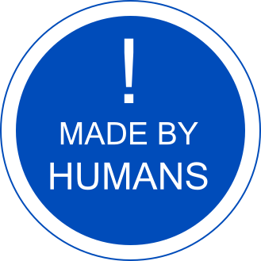

# Brand

Brand image and acceptable use policies.
This readme text and the OZI logo are licensed [CC BY-ND](https://creativecommons.org/licenses/by-nd/4.0/).
Fonts are hosted here for use in OZI Project webpages and services. 
Font source files are used under license terms included in their respective folders.

## Fonts

The OZI Project prefers to present english language copy in Atkinson Hyperlegible,
treated as a sans-serif. For specialized emphasis and serif we prefer Noto Serif HK.
For monospace and code presentation we prefer Martian Mono. The preferred font for logo
lockup is Latin Modern Mono for the OZI application and Atkinson Hyperlegible for the greater
OZI Project organization.

## Logos

The original OZI Project logo was designed by Eden Rose MSc by layering the letters "OZI" in
Latin Modern Mono. This was then rescaled to approximate the small cap version x-height,
making the logo roughly square. The overlapping serifs were then removed and the outer strokes
were transformed spherically to yield the second version of the logo that is currently in use.

* ✅ Invert the logo up to .8 for visual contrast.

* 🛑 DO NOT add your own colorways or background.
* 🛑 DO NOT distort or obscure the OZI logo.
* 🛑 DO NOT use the OZI logo in such a way as to suggest endorsement or affiliation.

## Generative AI Transparency

I, like many, have strong feelings about the use of generative AI. However, outright rejection of any AI-generated content is an infeasably strong rubric. I believe that we should make every endeavour to account for ANY use of generative AI and mark it appropriately while also marking copy that is wholly human-created as such.

\- Eden Rose Duff MSc

