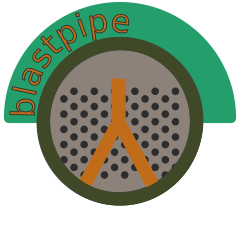

# Brand

Brand image and acceptable use policies.
This README text, the OZI logo, OZI badge, and blastpipe logo are licensed [CC BY-ND](https://creativecommons.org/licenses/by-nd/4.0/).
Fonts are hosted here for use in OZI Project webpages, documentation, and services.
Font source files are used under license terms included in their respective folders.

## Font Lockup

### Web

In English typeset copy:

* Atkinson Hyperlegible for sans-serif
* Noto Serif HK for specialized emphasis and serif
* Martian Mono for monospace and code presentation
* Latin Modern Mono or Martian Mono for OZI application media logo lockup
* Atkinson Hyperlegible for OZI Project organization media logo lockup

### Print

Use Martian Mono for OZI logo lockup on cover pages.

In English typeset copy:

* TeX Gyre Heros for sans-serif
* TeX Gyre Termes for serif
* TXTT for monospace

## Images

### OZI Logo

The original OZI Project logo was designed by Eden Ross Duff MSc by layering the letters "OZI" in
Latin Modern Mono. This was then rescaled to approximate the small cap version x-height,
making the logo roughly square. The overlapping serifs were then removed and the outer strokes
were transformed spherically to yield the second version of the logo that is currently in use.

* ✅ Invert the logo up to .8 for visual contrast.

* 🛑 DO NOT add your own colorways or background.
* 🛑 DO NOT distort or obscure the OZI logo*.
* 🛑 DO NOT use the OZI logo in such a way as to suggest endorsement or affiliation.

*Note that the sole exception is the OZI Badge which uses an ink-bleed effect.
You should NOT do this with the OZI logo yourself, this is the only logo variant currently authorized.

### blastpipe logo

The blastpipe logo was designed by Eden Ross Duff.

* 🛑 DO NOT add your own colorways or background.
* 🛑 DO NOT distort or obscure the blastpipe logo*.
* 🛑 DO NOT use the blastpipe logo in such a way as to suggest endorsement or affiliation.

## Generative AI Transparency

I, like many, have strong feelings about the use of generative AI. However, outright rejection of any AI-generated content is an infeasably strong rubric. I believe that we should make every endeavour to account for ANY use of generative AI and mark it appropriately while also marking copy that is wholly human-created as such.

\- Eden Ross Duff MSc

